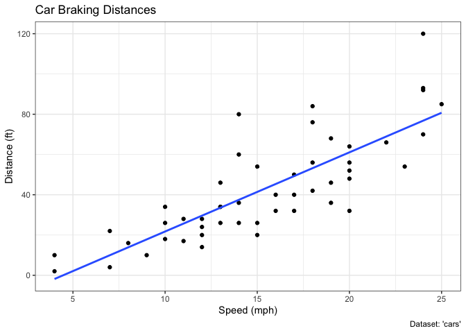

# Class 5 Data Visualization with ggplot2
Katelyn Wei (PID: A16682595)

## Using GGPLOT

The ggplot2 package does not come installed with R. Use the
`install.package()` function to do so.

``` r
head(cars)
```

      speed dist
    1     4    2
    2     4   10
    3     7    4
    4     7   22
    5     8   16
    6     9   10

To use ggplot I need to load up before I can call any of the functions
in the package. Use the `library()` function to do this.

``` r
library(ggplot2)
ggplot()
```


All ggplot figures have at least 3 things: - data(the stuff we want to
plot) - aesthetic mapping(assigned visual aspects to your data) - geoms
(how our dataset will be visualized)

``` r
ggplot(cars) + 
  aes(x=speed, y=dist) +
  geom_point()
```


ggplot is not the only graphing system in R - there are lots of others.
There are even “base R” graphics (remember the plot function?).

``` r
plot(cars)
```


## Lab 5

### 6. Creating Scatterplots

#### Cars Plot

Adding a trendline:

``` r
ggplot(cars) +
  aes(x=speed, y=dist) +
  geom_point() +
  geom_smooth()
```

    `geom_smooth()` using method = 'loess' and formula = 'y ~ x'


straightening the line and removing the shaded region:

``` r
ggplot(cars) +
  aes(x=speed, y=dist) +
  geom_point() +
  geom_smooth(method = "lm", se = FALSE)
```

    `geom_smooth()` using formula = 'y ~ x'


Adding labels and removing color:

``` r
ggplot(cars) +
  aes(x=speed, y=dist) +
  geom_point() +
  geom_smooth(method = "lm", se = FALSE) +
  labs(title="Car Braking Distances", x="Speed (mph)", y="Distance (ft)", caption="Dataset: 'cars'") +
  theme_bw()
```

    `geom_smooth()` using formula = 'y ~ x'



#### Genes Plot

``` r
url <- "https://bioboot.github.io/bimm143_S20/class-material/up_down_expression.txt"
genes <- read.delim(url)
head(genes)
```

            Gene Condition1 Condition2      State
    1      A4GNT -3.6808610 -3.4401355 unchanging
    2       AAAS  4.5479580  4.3864126 unchanging
    3      AASDH  3.7190695  3.4787276 unchanging
    4       AATF  5.0784720  5.0151916 unchanging
    5       AATK  0.4711421  0.5598642 unchanging
    6 AB015752.4 -3.6808610 -3.5921390 unchanging

Basic Scatterplot:

``` r
p <- ggplot(genes) +
  aes(x = Condition1, y = Condition2) +
  geom_point()
p
```


Adding/changing the colors and adding labels:

``` r
p + aes(color=State) +
  scale_color_manual(values = c("blue", "gray", "red")) + 
  labs(title = "Gene Expression Changes Upon Drug Treatment", x = "Control (no drug)", y = "Drug Treatment")
```


### 7. Going Further

``` r
library(gapminder)
library(dplyr)
```


    Attaching package: 'dplyr'

    The following objects are masked from 'package:stats':

        filter, lag

    The following objects are masked from 'package:base':

        intersect, setdiff, setequal, union

Basic Scatterplot:

``` r
gapminder_2007 <- gapminder %>% filter(year==2007)
ggplot(gapminder_2007) +
  aes(x=gdpPercap, y=lifeExp) +
  geom_point()
```


1957 Data Plot:

``` r
gapminder_1957 <- gapminder %>% filter(year==1957)
ggplot(gapminder_1957) +
  aes(x=gdpPercap, y=lifeExp, color=continent, size=pop) +
  geom_point(alpha=0.7) +
  scale_size_area(max_size = 15)
```


Comparing 1957 to 2007:

``` r
gapminder_1957 <- gapminder %>% filter(year==1957 | year==2007)
ggplot(gapminder_1957) +
  aes(x=gdpPercap, y=lifeExp, color=continent, size=pop) +
  geom_point(alpha=0.7) +
  scale_size_area(max_size = 15) +
  facet_wrap(~year)
```


