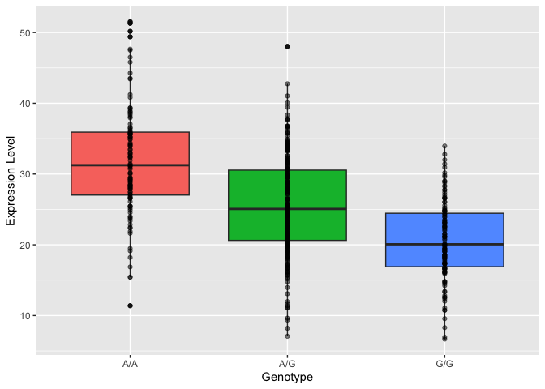

# Week 12: RNAseq Galaxy
Katelyn Wei (PID: A16682595)

# Part 4: Population Scale Analysis

~230 gene samples were processed from a population and placed in the
file “PopAnalysis.txt”.

Q13: Determine the sample size for each genotype and their corresponding
median expression levels for each of these genotypes.

Let’s first look at what we’ve got.

``` r
x <- read.table("PopAnalysis.txt")
```

There are 462 samples in this table based on the `nrow()` function:

``` r
nrow(x)
```

    [1] 462

We can use the `sum()` function and logicals to find the sample size of
each genotype:

``` r
# Sample size A/A
sum(x[,2] == "A/A")
```

    [1] 108

``` r
# Sample size A/G
sum(x[,2] == "A/G")
```

    [1] 233

``` r
# Sample size G/G
sum(x[,2] == "G/G")
```

    [1] 121

Now how do we get the median of each? Using the dplyr package, we can
`group_by()` genotype then use `summarize()` to find median expression
levels:

``` r
library(dplyr)
```


    Attaching package: 'dplyr'

    The following objects are masked from 'package:stats':

        filter, lag

    The following objects are masked from 'package:base':

        intersect, setdiff, setequal, union

``` r
x %>%
  group_by(geno) %>%
  summarize(medianGeno = median(exp))
```

    # A tibble: 3 × 2
      geno  medianGeno
      <chr>      <dbl>
    1 A/A         31.2
    2 A/G         25.1
    3 G/G         20.1

> Q14: Generate a boxplot with a box per genotype. What could you infer
> from the relative expression value between A/A and G/G displayed in
> this plot? Does the SNP affect the expression of ORMDL3?

``` r
# Boxplot using ggplot
library(ggplot2)

ggplot(x, aes(geno, exp, fill = geno)) +
  geom_boxplot() +
  geom_point(alpha = 0.5) +
  labs(x = "Genotype", y = "Expression Level") +
  theme(legend.position = "none")
```



Based on this plot, you can infer that A/A tend to have higher
expression levels than G/G. The SNP seems to affect ORMDL3 expression.
