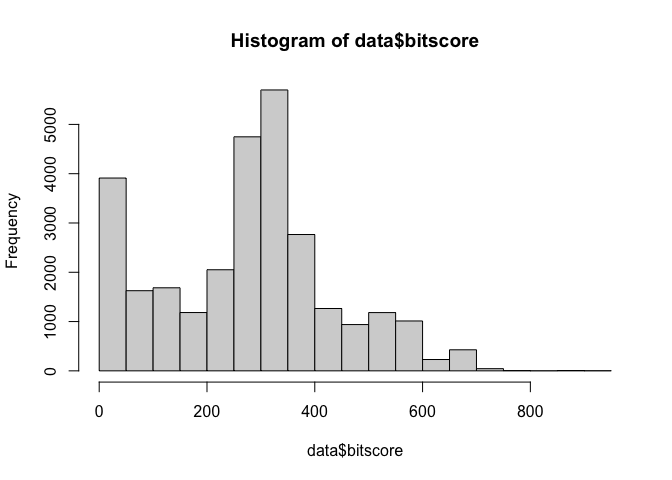
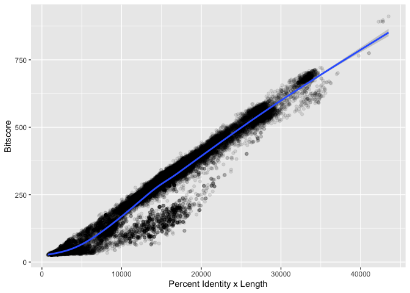

# Class 17: Unix Basics
Katelyn Wei (PID: A16682595)

# Remote AWS Instance Questions

> Q1. Consider `gunzip *.faa.gz`. What does the star character
> accomplish here? Ask Barry, or your class neighbor, if you are not
> sure!

The star character acts as a “fill-in-the-blank”. In this case, any file
that ends with .faa.gz would be unzipped.

> Q2. How many sequences are in this mouse.1.protein.faa file? Hint: Try
> using grep to figure this out…

56,158

> Q3. Consider `head -11 mouse.1.protein.faa > mm-first.fa`. What
> happens if you run the above command without the \> mm-first.fa part?

It immediately spits out the first 11 lines instead of putting it into a
new file.

> Q4. What happens if you were to use two ‘\>’ symbols
> (i.e. `>> mm-first.fa`)?

Using two symbols should cause the file to have 2 copies of the first 11
lines.

> Q5.How would you determine how many sequences are in the mm-second.fa
> file?

`grep -c ">" mm-second.fa`

# Output Graph

Reading our tsv file:

``` r
x <- "mm-second.x.zebrafish.tsv"
data <- read.delim(x, col.names = c("qseqid", "sseqid", "pident", "length", "mismatch", "gapopen", "qstart", "qend", "sstart", "send", "evalue", "bitscore"))

head(data)
```

           qseqid         sseqid pident length mismatch gapopen qstart qend sstart
    1 NP_598866.1 NP_001313634.1 46.154    273      130       6      4  267    476
    2 NP_598866.1 XP_009294513.1 46.154    273      130       6      4  267    475
    3 NP_598866.1 NP_001186666.1 33.071    127       76       5      4  126    338
    4 NP_598866.1 NP_001003517.1 30.400    125       82       4      4  126    344
    5 NP_598866.1 NP_001003517.1 30.645     62       41       2     53  113     43
    6 NP_598866.1    NP_956073.2 34.444     90       56       3     40  126    527
      send   evalue bitscore
    1  740 4.51e-63    214.0
    2  739 4.69e-63    214.0
    3  459 5.19e-12     67.8
    4  465 2.67e-11     65.5
    5  103 4.40e-01     33.9
    6  616 1.70e-10     63.2

Histogram of `$bitscore` values:

``` r
hist(data$bitscore, breaks = 30)
```



There are a lot of okay (200-400) and terrible(0-50) bit scores. There
are much fewer good, high scores.

Are bitscores related to percent identity? Let’s plot a graph and find
out:

``` r
library(ggplot2)
ggplot(data, aes(pident, bitscore)) +
  geom_point(alpha = 0.1) +
  labs(x = "Percent Identity", y = "Bitscore")
```


The relationship only looks somewhat linear. This makes sense because
bitscores also factor in alignment length. This second graph reflects
it:

``` r
ggplot(data, aes((pident*(qend - qstart)), bitscore)) +
  geom_point(alpha = 0.1) +
  geom_smooth() +
  labs(x = "Percent Identity x Length", y = "Bitscore")
```

    `geom_smooth()` using method = 'gam' and formula = 'y ~ s(x, bs = "cs")'



I did this on my personal computer. However, if done on on the remote
machine, you need to knit your Rmarkdown document and transfer
everything back to YOUR LOCAL computer using scp and this code:

`scp -i ~/Downloads/barry_bioinf.pem -r ubuntu@YOUR_IP_ADDRESS:~/work/* .`

> Q. Note the addition of the -r option here: What is its purpose? Also
> what about the \*, what is it’s purpose here?

The -r option is to copy entire directories, allowing you to transfer
the folder that holds the R project and quarto document. The \* lets you
bring over everything that was sitting in the work directory.
