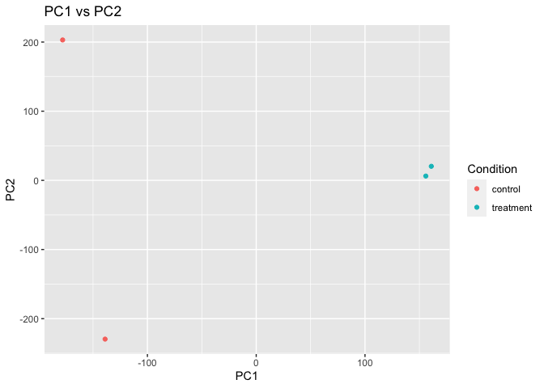
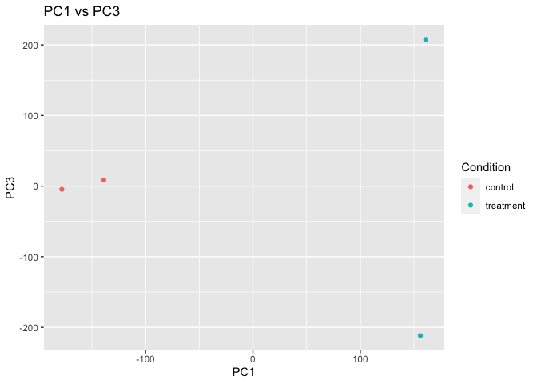
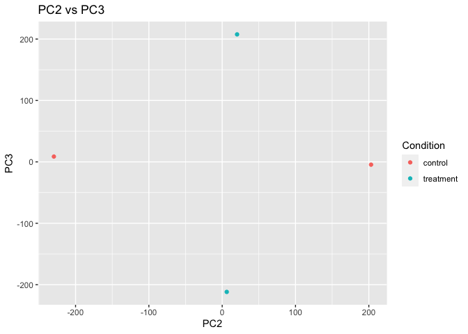

# Class 18
Katelyn Wei (PID: A16682595)

# Downstream Analysis

I downloaded the tximport package. The directories containing the
callisto outputs have been added to my computer.

``` r
library(tximport)
library(rhdf5)
```

    Warning: package 'rhdf5' was built under R version 4.3.2

``` r
# setup the folder and filenames to read
folders <- dir(pattern="SRR21568*")
samples <- sub("_quant", "", folders)
files <- file.path( folders, "abundance.h5" )
names(files) <- samples

txi.kallisto <- tximport(files, type = "kallisto", txOut = TRUE)
```

    1 2 3 4 

``` r
head(txi.kallisto$counts)
```

                    SRR2156848 SRR2156849 SRR2156850 SRR2156851
    ENST00000539570          0          0    0.00000          0
    ENST00000576455          0          0    2.62037          0
    ENST00000510508          0          0    0.00000          0
    ENST00000474471          0          1    1.00000          0
    ENST00000381700          0          0    0.00000          0
    ENST00000445946          0          0    0.00000          0

``` r
# transcripts per sample
colSums(txi.kallisto$counts)
```

    SRR2156848 SRR2156849 SRR2156850 SRR2156851 
       2563611    2600800    2372309    2111474 

``` r
# detected transcripts in at least 1 sample
sum(rowSums(txi.kallisto$counts)>0)
```

    [1] 94561

``` r
# Filtering out transcripts with no leads
to.keep <- rowSums(txi.kallisto$counts) > 0
kset.nonzero <- txi.kallisto$counts[to.keep,]

# Filtering out transcripts with no change over samples
keep2 <- apply(kset.nonzero, 1, sd) > 0
x <- kset.nonzero[keep2,]
```

# PCA

``` r
# computing principal components
pca <- prcomp(t(x), scale=TRUE)
summary(pca)
```

    Importance of components:
                                PC1      PC2      PC3   PC4
    Standard deviation     183.6379 177.3605 171.3020 1e+00
    Proportion of Variance   0.3568   0.3328   0.3104 1e-05
    Cumulative Proportion    0.3568   0.6895   1.0000 1e+00

``` r
# base R plot of PC1 and PC2
plot(pca$x[,1], pca$x[,2],
     col=c("blue","blue","red","red"),
     xlab="PC1", ylab="PC2", pch=16)
```


> Q. Use ggplot to make a similar figure of PC1 vs PC2 and a seperate
> figure PC1 vs PC3 and PC2 vs PC3.

First we need to turn the data input into a dataframe:

``` r
df <- as.data.frame(pca$x)
df$Condition <- c("control", "control", "treatment", "treatment")
```

``` r
library(ggplot2)

# PC1 vs. PC2
ggplot(df, aes(PC1, PC2, col=Condition)) +
  geom_point() +
  labs(title = "PC1 vs PC2")
```



``` r
# PC1 vs. PC3
ggplot(df, aes(PC1, PC3, col=Condition)) +
  geom_point() +
  labs(title = "PC1 vs PC3")
```



``` r
# PC2 vs. PC3
ggplot(df, aes(PC2, PC3, col=Condition)) +
  geom_point() +
  labs(title = "PC2 vs PC3")
```


